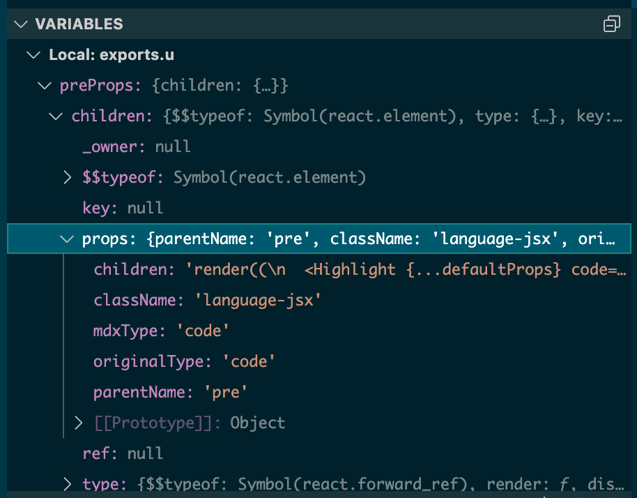

当ブログは以下の技術で作成しています。
- gatsby: "4.14.1"
- @mdx-js/mdx: "^1.6.22"
- @mdx-js/react: "^1.6.22"

今回技術ブログとしては必須のコードブロックのシンタックスハイライトを導入しました。
[修正がまとまったPRです](https://github.com/Hyuga-Tsukui/blog/pull/12/files)

## 試したパターンと雑感

今回2パターン試しており両方を紹介しますが、**導入したのはタイトルの通りprism-react-renderer**になります。

### 1. prism-react-rendererを利用する
より確実にプラグインででレンダリングされるコードブロックのUIを制御できます、gatsby-remark-prismjsがCSSの上書きなどで制御するのに対し、prism-react-rendererは提供されたコンポーネントを利用して独自のコードブロックコンポーネントが書けます。

公式ママ↓
```jsx
render((
  <Highlight {...defaultProps} code={exampleCode} language="jsx">
    {({ className, style, tokens, getLineProps, getTokenProps }) => (
      <pre className={className} style={style}>
        {tokens.map((line, i) => (
          <div {...getLineProps({ line, key: i })}>
            {line.map((token, key) => (
              <span {...getTokenProps({ token, key })} />
            ))}
          </div>
        ))}
      </pre>
    )}
  </Highlight>,
```

### 2. gatsby-remark-prismjsを利用する

pluginサポートが豊富で導入が楽です。手順は後述しますが導入するだけならpluginの設定だけで完結します。
その分カスタマイズ性に難あり
この難点は[こちらの方のブログ](https://kimuson.dev/blog/gatsby/replace_gatsby_blog_mdx/#:~:text=%E3%81%AA%E3%82%8A%E3%81%BE%E3%81%97%E3%81%9F%EF%BC%81-,%E3%82%B3%E3%83%BC%E3%83%89%E3%83%8F%E3%82%A4%E3%83%A9%E3%82%A4%E3%83%88,-Mdx%20%E3%81%B8%E3%81%AE)が非常に参考になります。


## prism-react-rendererを利用する場合

導入するにあたって、[MDX](https://mdxjs.com/ "公式")のアプローチを知っておくとハマりにくくなると思いました。
さらっとまとめると、**MDXはMarkdownのスーパセットで、文書内にJSXを記述することができます。**

そのため、各種Markdownの構文はいずれもJSXコンポーネントで表現され独自のカスタムコンポーネントをインポートし利用することも可能で、
コードブロックを示す **```**は<Pre/>コンポーネントで[表現](https://mdxjs.com/table-of-components/#:~:text=p%3E%0A%3C/%3E-,pre,-%60%60%60js%0Abacktick.fences)されます。

prism-react-rendererはPrism.jsのシンタックスハイライトを利用したJSXコンポーネントを提供するライブラリです。
MDXのJSXを利用できるという特性を活かし、preタグをprism-react-rendererで置き換える手法になります。 

MDXは標準のコンポーネントを置き換える仕組みとして[MDXProvider](https://github.com/mdx-js/mdx/tree/main/packages/react)を用意しています。
公式ママ↓

```jsx
import {MDXProvider} from '@mdx-js/react'
import Post from './post.mdx'
// ^-- Assumes an integration is used to compile MDX to JS, such as
// `@mdx-js/esbuild`, `@mdx-js/loader`, `@mdx-js/node-loader`, or
// `@mdx-js/rollup`, and that it is configured with
// `options.providerImportSource: '@mdx-js/react'`.

const components = {
  em: props => <i {...props} />
}

<MDXProvider components={components}>
  <Post />
</MDXProvider>
```

またMDXPrividerの挙動に対して非常にわかりやすい説明が[ISSUE](https://github.com/mdx-js/mdx/issues/197)でやり取りされていたので載せておきます

まとめとして
1. prism-react-rendererを利用したコードブロック用のコンポーネントを作成する
2. MDXProviderを通して、preタグを1で作成したコンポーネントで上書きする

### mdx-utilsのインストール
ゴールとしてはprism-react-rendererのHighlightコンポーネントに以下のPropsを渡す必要があります。

- code本体のstring
- 言語タグ

MDXProviderを通して、Markdown記法で記載した情報(MDXTagというらしい）から渡ってくるPropsは下記の構造をしています。



ポイント
- children>props>childrenにコード情報が入っている
- children>classNameに言語タグが入っている

これらをHighlightコンポーネントにわたすことで、言語に応じたシンタックスハイライトを適用したコードブロックをレンダリングできます。

構造が深く、複雑なので簡単に抜き出すことができる[mdx-utils](https://github.com/ChristopherBiscardi/gatsby-mdx/tree/00769a1b72455f40843cd2f09ee34fd63b009fb2/packages/mdx-utils)というライブラリを利用します。
等ライブラリを作った方の[ブログ](https://www.christopherbiscardi.com/post/codeblocks-mdx-and-mdx-utils)も載せます。

またmdx-utilsはtypesの提供が無いためTS環境ではエラーがでるまたはrequireを利用してのany運用になります。
今回は[こちらのブログ](https://kimuson.dev/blog/gatsby/replace_gatsby_blog_mdx/)を参考に.d.tsを定義しました。


### 標準のPreコンポーネントを置き換える
こちらも何度も紹介している [こちらのブログ](https://kimuson.dev/blog/gatsby/replace_gatsby_blog_mdx/#:~:text=%E3%83%8F%E3%82%A4%E3%83%A9%E3%82%A4%E3%83%88%E9%83%A8%E5%88%86%E3%81%AF%E3%81%BB%E3%81%BC%20prism%2Dreact%2Drenderer%20%E3%81%AE%E3%82%B5%E3%83%B3%E3%83%97%E3%83%AB%E3%81%9D%E3%81%AE%E3%81%BE%E3%81%BE%E3%81%A7%E3%81%99_)の通りとなります。
基本的にコードブロックを作る箇所は公式通りになるので、同じような形になると思います。

プラスαで、TS環境の場合Languageの型解決でエラーになる可能性があります。
というのも`preToCodeBlock`の戻り値であるlanguageがstring型のためです。

そのため、Languageからいい感じにTypeGurdを作りたいところです。
しかしながらUnionTypeからStringの配列を生成することはできなさそう（逆はできる）なので若干Dry原則に反しますが以下のようにチェック関数を作りました。

```tsx

//HACK この関数は不安定です。厳密にLanguageTypeと一致しないので壊れる可能性がある
const isLanguageType = (languageString: string): languageString is Language => {
  switch (languageString) {
    case "markup":
    case "bash":
    case "clike":
    case "c":
    case "cpp":
    case "css":
    case "javascript":
    case "jsx":
    case "coffeescript":
    case "actionscript":
    case "css-extr":
    case "diff":
    case "git":
    case "go":
    case "graphql":
    case "handlebars":
    case "json":
    case "less":
    case "makefile":
    case "markdown":
    case "objectivec":
    case "ocaml":
    case "python":
    case "reason":
    case "sass":
    case "scss":
    case "sql":
    case "stylus":
    case "tsx":
    case "typescript":
    case "wasm":
    case "yaml":
      return true;
    default:
      return false;
  }
};

const PreComponent: React.FC<PreProps<ChildrenProps>> = (
  preProps: PreProps<ChildrenProps>
) => {
  const props = preToCodeBlock<ChildrenProps>(preProps);
  const { codeString, language } = props;
  //ここで型を絞り込む
  if (codeString && isLanguageType(language)) {
    return <Code codeString={codeString} language={language} />;
  } else {
    return <pre {...preProps} />;
  }
};
```

あとは作成したPreComponentをMDXProviderを通してビルド時に置き換えるようにします。
私はMDXCompnentsの置き換えの定義用のファイルを用意しています。最終的にはMDXProviderのPropsに渡せばよいだけなのでどこに定義しても問題ありません。

```tsx
// src/MDXCompnents/index.ts
import { PreComponent } from './pre';

const MDXComponents = {
    pre: PreComponent
}

export default MDXComponents;
```

定義したMDXComponentsを以下のようにMDXRenderを含むように定義します。Rootに定義してもよいですか今回は最小スコープとしました。

```tsx

const BlogPost: FC<Props> = (props) => {
  const { data } = props;
  return (
    <Layout pageTitle={data.mdx?.frontmatter?.title || "NON TITLE"}>
      <MDXProvider components={MDXComponents}>
        <MDXRenderer>{data.mdx?.body || ""}</MDXRenderer>
      </MDXProvider>
    </Layout>
  );
};

```

以上で、コードブロックで記載したMDがハイライトされるかと思います。


##  gatsby-remark-prismjsを利用する場合
基本的なインストール等は[公式](https://www.gatsbyjs.com/plugins/gatsby-remark-prismjs/?=syntax#gatsby-remark-prismjs)に譲ります。

ただ、公式はremarkの利用を前提としているため私のようにmdxを利用している場合は独自の設定が必要になりますので紹介します。

gatsby-plugin-mdxにはremarkのエコシステムを利用するための互換性を維持した機能があります。remarkプラグインも設定をすれば違和感なく利用できるっていう機能ですね。
[gatsby-remark-plugins](https://www.gatsbyjs.com/plugins/gatsby-plugin-mdx/#gatsby-remark-plugins)

今回はgatsby-remark-prismjsを利用するために以下の設定を`gatsby-config.ts`に追記します。

```javascript

const config: GatsbyConfig = {
  plugins: [
    "gatsby-plugin-mdx",
    `gatsby-remark-prismjs`,
    {
      resolve: `gatsby-plugin-mdx`,
      options: {
        gatsbyRemarkPlugins: [
          {
            resolve: `gatsby-remark-prismjs`
          }
        ]
      }
    }
  ],
};

```

公式の説明の通り、利用したいramarkプラグインのresolveとしてgatsby-plugin-mdxを設定します。
gatsby-remark-prismjsはGlobalなPrism.js用のCSSを読み込む必要があるため
gatsby-browser.tsで対象のCSSを読み込むように設定します。存在しない場合は新規作成してください。
gatsbyのCSSの仕様は公式の[How-To Guides](https://www.gatsbyjs.com/docs/how-to/styling/global-css/#adding-global-styles-without-a-layout-component)が大変わかりやすいです。

```javascript
//themesはいくつかあるのでお好みのものを指定します。
require("prismjs/themes/prism-tomorrow.css")
```

以上で導入完了です。細かいCSSの設定が必要な場合はprismjsで当たるCSSを!importantなどを利用して上書きする必要があったりするようです。
私は今回はここまでしか試していないので、ミニマムにこちらではじめて要件が満たさなくなったら乗り換える等もありかと重います。
おそらくprism-react-rendererへの乗り換えは仕組み上、簡単で以下の手順だけで済む思います。
- gatsby-remark-prismjsのアンイストール
- prism-react-rendererのインストールと必要な設定

gatsby-remark-prismjsがそもそも実装依存したようなものではないので、ほぼ新規に prism-react-rendererをインストールするだけで済みそうですね。

## 参考にさせていただいた記事

- [Gatsby で技術ブログを作る際の知見](https://kimuson.dev/blog/gatsby/gatsby-blog/)
- [Codeblocks, MDX, and mdx-utils](https://www.christopherbiscardi.com/post/codeblocks-mdx-and-mdx-utils)
  - 多分上の方はこちらを参考にしている？
