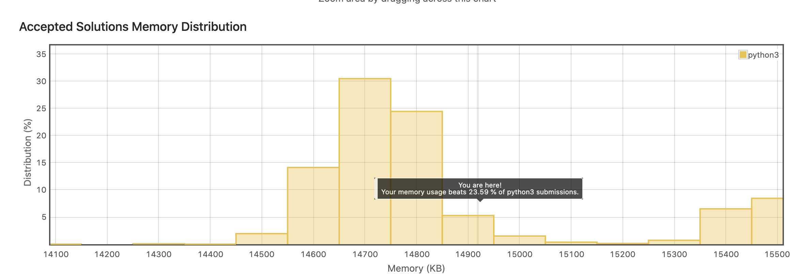

## til (Today I Learned)　＝ 今日私が学んだこと

一時期話題になっていたやつですねー。
なにかを学習する上で、情報のインプットとアウトプットのバランスは大変重要で、アウトプットの方が負荷が高く
忘れられがちですよね。自分はそうです。

tilというフレームワークはアウトプットに焦点を当てた学習のためのルールです。

色々やり方はありますが、私の場合は以下のルールで運用することにしました。

- コードを書くことに限定する
- 実行できる = 完了とする
- githubにpushする
- 週３日を最低とする

とりあえず、初手として題材がほしかったのleatCodeのデータ構造の実装周りをあげようかなと思い、連結リストの実装をPython3でしてみました。
連結リストそのものを利用する上での利点、欠点を理解はしていましたが、内部実装をしたことはなかったので新鮮でした。
余談ですがCS系を学んでいる人はこういうのを理解していると思うと、底地の強さを感じてしまいますね。。

普段あまりこういったアルゴリズムチックな処理を書かないので、テクニック的な面で学びがありました。

長さが不定のリストの末尾を取得するときにこういった書き方をして見ましたが、正しいのかわかりませんがこういったトラバース処理では今後も使いそうなきもしてます。

```python
while current_node and current_node.has_next():
    current_node = current_node.next()
```

[実装したコード](https://github.com/Hyuga-Tsukui/til/blob/main/leat-code/python/my_linked_list.py)



またブログでのここの取り上げは負荷が上がって、フレームワークの意味がないのでしません。
なんか学びがあったらいつもどおり書くと思います。

# 参考記事
https://blogs.lisb.direct/entry/2016-03-28-100000